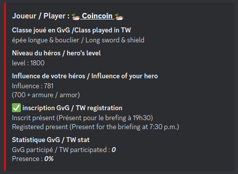
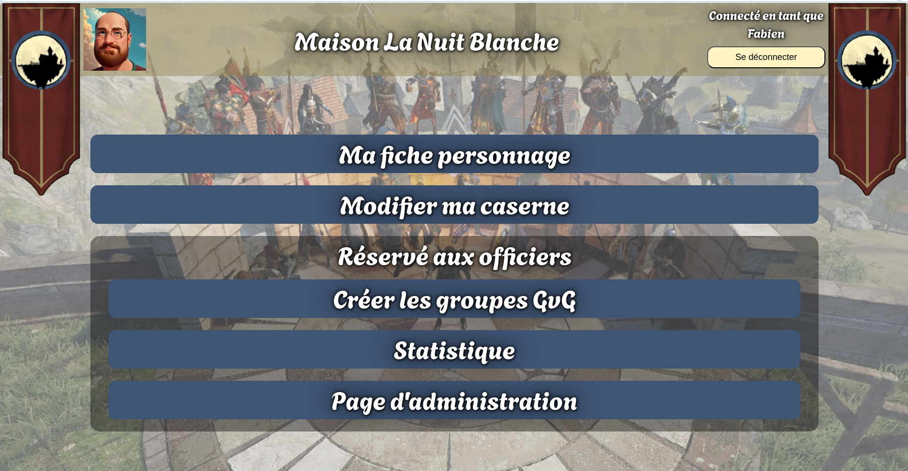
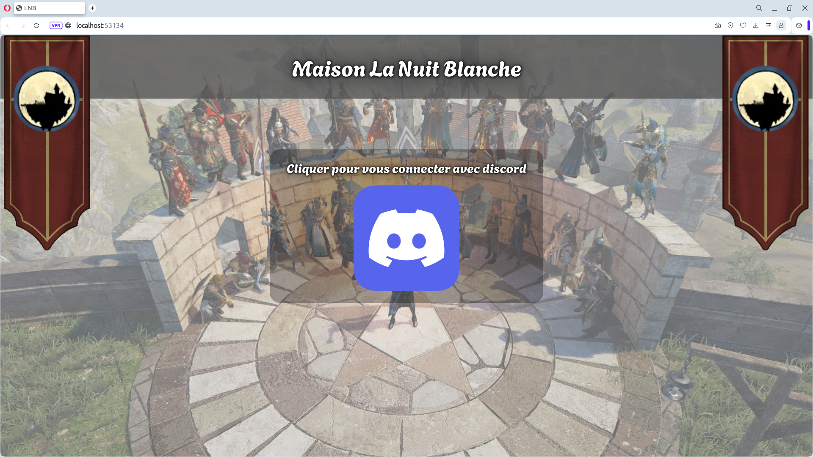
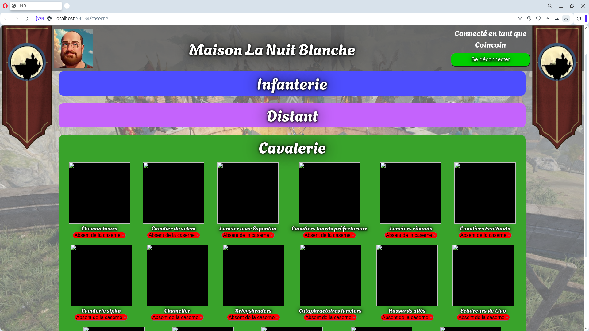
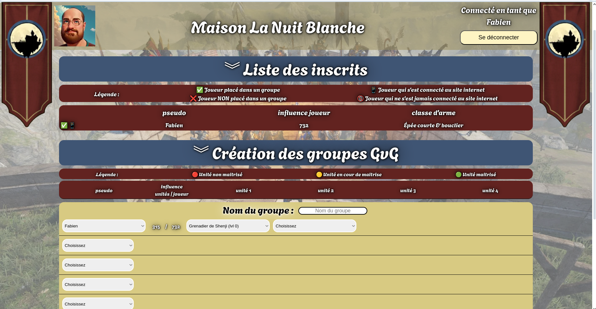
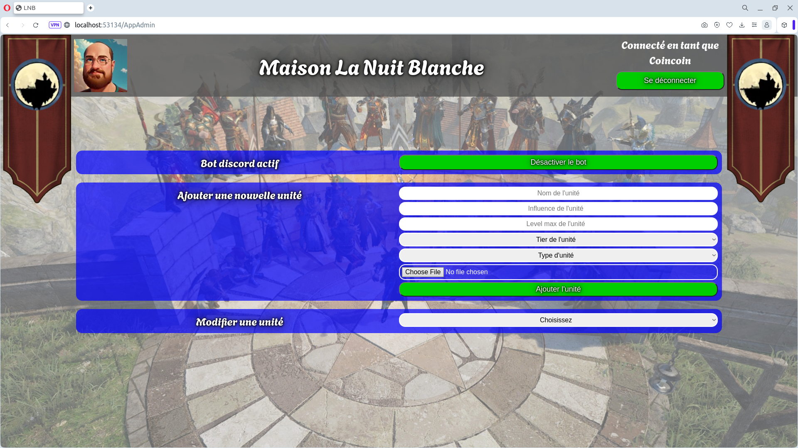

# Bot discord & site internet associé

### Descriptif
_______
Le projet se décompose en 2 partie, un bot discord et un site internet, les 2 applications ont en commum une base de données SQL [sqlite](https://www.sqlite.org).

**Partie 1 : le bot discord** <br>
Le bot discord permet de gérer de façon automatisée les inscriptions des joueurs pour le jeu [Conqueror's Blade](https://conqblade.com/fr). 
Les informations d'inscription des joueurs sont enregistré dans la base de donnée SQL, les joueurs peuvent ainsi donner la plupart des informations nécessaires à la préparation des GvG directement via discord.

Voici un exemple des informations visible est modifiable par chaque utilisateur <br>


**Partie 2 : le site internet** <br>
débloquée en jeu. Ils peuvent également mettre à jour les informations de leur héros pour ceux qui n'apprécient pas de le faire via discord.
Les officiers de la guilde ont accès à plusieurs onglets dont ne dispose pas un simple utilisateur, ils peuvent créer les groupes GvG pour la prochaine guerre de territoire, ils peuvent administrer le bot (activé ou désactivé des fonctions automatiques, ajouter de nouvelles unités, etc.), Ils accèdent également à une page de statistique des informations contenu dans la base de donnée.

Voici quelque exemple de page internet <br>
<table align= "center" width="95%">
    <tbody>
        <tr>
            <td colspan="2"></td>
        </tr>
        <tr>
            <td></td>
            <td></td>
        </tr>
        <tr>
            <td></td>
            <td></td>
        </tr>    
    </tbody>
</table>


### Usage
_______
**Méthode manuel :** <br>
Pour demarrer le bot discord
```sh
cd bot
npm start
```
Pour demarrer le site internet
```sh
cd site
go run ./cmd/main.go
```

**Méthode dockerfile :**
```sh
docker compose up
```


### Dépendence
_______
**Partie 1 : le bot discord** <br>
Le serveur utilise la version 18 de [nodeJS](https://nodejs.org/en) est le gestionnaire de paquets [npm](https://www.npmjs.com) version 9.<br>

**Partie 2 : le site internet** <br>
Le front utilise du `javascript`, `html` et `css`.<br>
Le back utilise un serveur en `go version 1.21` ainsi que les librairie suivante :
- [godotenv](https://github.com/joho/godotenv)
- [uuid](https://github.com/gofrs/uuid)
- [go-sqlite3](https://github.com/mattn/go-sqlite3)

### Authors
_______
+ Fabien OLIVIER