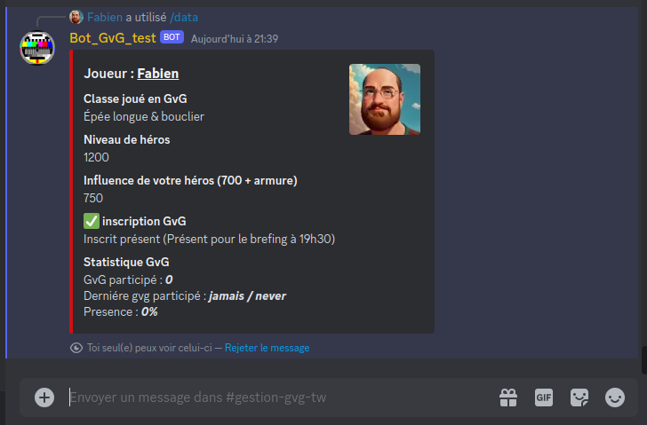

# Bot Discord & site internet pour Conqueror's Blade

### Descriptif
_______
Le projet permet de gérer de façon automatisée les inscriptions aux Guildes versus Guilde (GvG) des joueurs pour le jeu [Conqueror's Blade](https://conqblade.com/fr) et la préparation des batailles en créant les groupes à l'avance avec les informations nécessaires pour optimiser les groupes.<br>
Le projet se décompose en 2 partie, un bot [Discord](https://discord.com) et un site internet, les 2 applications ont en commum une base de données SQL.

**Partie 1 : le bot Discord** <br>
Le bot Discord permet aux utilisateurs de s'inscrire via Discord. Les informations d'inscription des joueurs sont enregistré dans la base de donnée SQL, les joueurs peuvent ainsi donner la plupart des informations nécessaires à la préparation des GvG.<br>
Les commandes sont enregistrées en tant que "Slash Command" Discord et sont accessibles avec une description aux utilisateurs directement sur Discord.

<table align= "center" width="95%">
    <tbody>
        <tr>
            <td></td>
            <td></td>
        </tr>   
    </tbody>
</table>

**Partie 2 : le site internet** <br>
Seul les utilisateurs presents sur le Discord associé peuvent se connecté au site internet. Les roles Discord permettent de gérer automatiquement les accées privilégier ou non au site.
Les utilisateurs peuvent indiqué la liste des unités qu'ils ont débloquée en jeu ainsi que le niveau des unités en question. Ils peuvent également mettre à jour les informations de leur héros pour ceux qui n'apprécient pas de le faire via Discord.

Les officiers de la guilde ont accès à plusieurs onglets dont ne dispose pas un simple utilisateur, ils peuvent créer les groupes GvG pour la prochaine guerre de territoire, ils peuvent administrer le bot (activé ou désactivé des fonctions automatiques, ajouter de nouvelles unités, etc.), Ils accèdent également à une page de statistique des informations contenu dans la base de donnée.

<table align= "center" width="95%">
    <tbody>
        <tr>
            <td></td>
            <td></td>
        </tr>
        <tr>
            <td></td>
            <td></td>
        </tr>
        <tr>
            <td></td>
            <td></td>
        </tr>    
    </tbody>
</table>


### Usage
_______
**Avant de pouvoir exécuter le programme :**<br>
- Crée votre application Discord sur la [plateforme de développement Discord](https://discord.com/developers/applications).
- Générer le lien d'invitation de votre application Discord et ajouté votre bot à votre serveur Discord.
- Crée le fichier (variable d'environnement) `.env` dans la racine du projet. Dans ce fichier, mettez le `TOKEN` de l'application Discord ainsi que le `PORT` souhaité pour le site web associé.
- Créé le fichier (base de données) nommé `databaseGvG.db` dans le dossier `/database` (le script SQL est là pour vous permettre de générer les tables et une base d'unité).
- Dans le fichier `./bot/Main.js` vous devez modifier la partie `Adaptation (ligne 19 à 44)` qui permet d'adapté le code automatiquement à votre serveur Discord.

**Méthode de lancement manuel :** <br>
Pour demarrer le bot Discord (se trouve dans le dossier `/bot`)
```sh
npm start
```
Pour demarrer le site internet (se trouve dans la racine du dossier)
```sh
go run ./cmd/main.go
```

**Méthode de lancement dockerfile (avec supervisord) :**<br>
Permet de lancer le bot Discord ainsi que le site internet en même temps dans un docker 
```sh
sudo docker build -t nameappli .
```


### Dépendence
_______
**Partie 1 : le bot Discord** <br>
Le serveur utilise la version 18 de [nodeJS](https://nodejs.org/en) est les module [npm](https://www.npmjs.com) version 9 suivant :<br>
- [sqlite3](https://www.npmjs.com/package/sqlite3)
- [moment-timezone](https://www.npmjs.com/package/moment-timezone)
- [cron](https://www.npmjs.com/package/cron)

**Partie 2 : le site internet** <br>
Le front utilise du `javascript`, `html` et `css`.<br>
Le back utilise un serveur en `go version 1.21` et les librairies suivante :
- [godotenv](https://github.com/joho/godotenv)
- [uuid](https://github.com/gofrs/uuid)
- [go-sqlite3](https://github.com/mattn/go-sqlite3)

### Authors
_______
+ Fabien OLIVIER